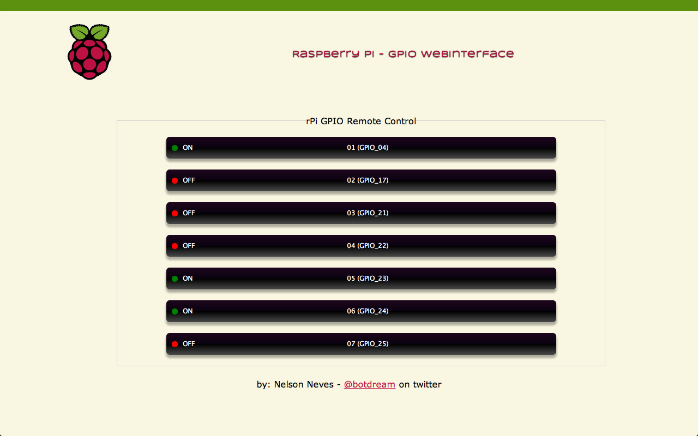
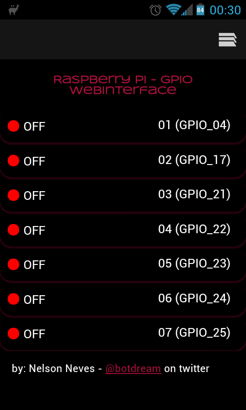
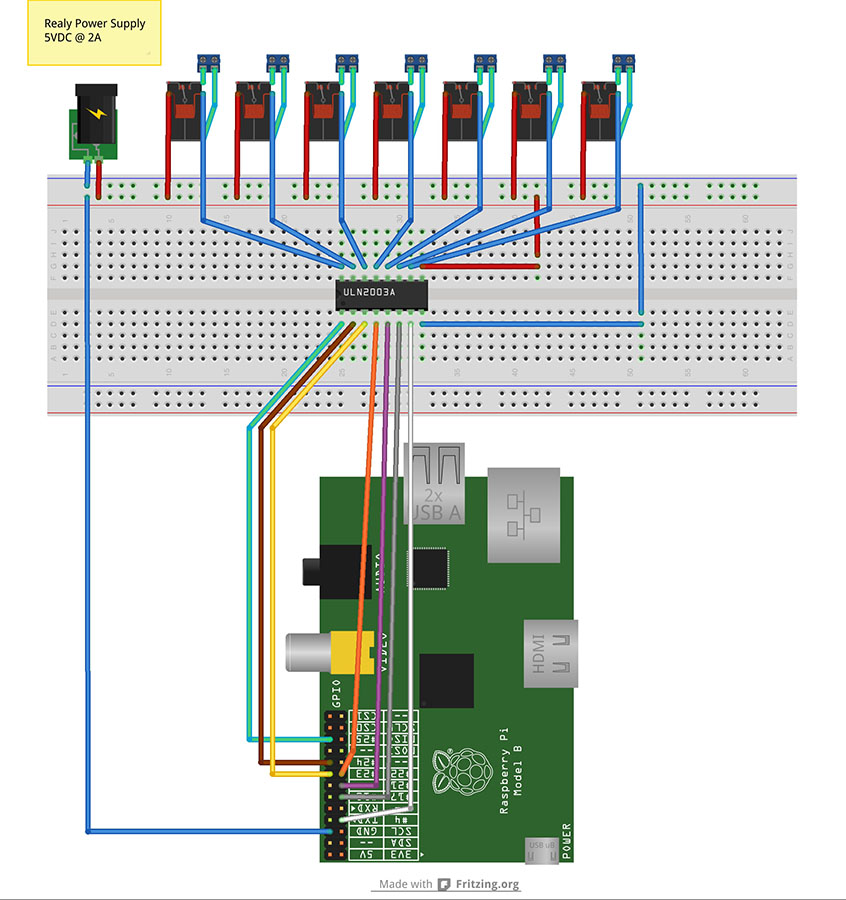

Raspberrypi GPIO Remote Control
------------------

Remote control appliances via WebInterface by using a RaspberryPi + Node.js + GPIO Relay control board (turning On/Off a coffee machine, toaster, heater, etc from a webpage in your mobile phone, tablet or laptop)

Desktop UI version (by Jorge Encarnação - @jfgen)



Mobile/Tablet UI experimental version (by Jorge Encarnação - @jfgen)



GPIO additional info
------------------
General Purpose Input/Output (GPIO)
http://elinux.org/Rpi_Low-level_peripherals#General_Purpose_Input

GPIO Driving Example (Shell script)
http://elinux.org/Rpi_Low-level_peripherals#GPIO_Driving_Example_.28Shell_script.29

Safe control GPIO from command line
http://quick2wire.com/2012/05/safe-controlled-access-to-gpio-on-the-raspberry-pi/
https://github.com/quick2wire/quick2wire-gpio-admin

NPM dependencies
------------------
Raspberry Pi GPIO Remote control dependes on the following node.js packages:

* rpi-gpio
https://github.com/JamesBarwell/rpi-gpio.js

* Flatiron

* Socket.io

* others - please check package.json

How to compile node.js on a RaspberryPi
------------------
https://github.com/nneves/Raspberrypi_NodeJS

How to get things running
------------------
Clone project and install Node.js necessary packages
```bash
git clone git://github.com/nneves/Raspberrypi_GPIO.git

cd Raspberrypi_GPIO

npm install
```

Raspberry Pi GPIO access requires sudo (for gpio access - still working on a safer solution)
```bash
sudo node app.js 8080

or (for quick testing)

npm start
```

Experimental testing with WebSockets protocol
------------------
```bash
sudo node app.js 8080 websockets
```

GoogleTalk (XMPP) integration
------------------
https://github.com/nneves/Raspberrypi_GPIO_njsbot

Electronic Schematics
------------------



List of materials:
* 1 power supply 5VDC @ 2A (dedicated to electronic board)
* 1 power plug (jack)
* 7 relay 5DC (electromagnetic switch): NAIS DS2Y-S-DC5V
* 1 Darlington Transistor Driver chip ref: ULN2003AN
* 7 2-pins Screw Terminals

How to buy a (similar) pre-assembled electronic relay board
------------------
NOTE: un-tested, will try this module real soon!

Hobbytronics (UK) - fully assembled and RaspberryPi friendly (optically isolated): 
http://www.hobbytronics.co.uk/raspberry-pi/8-channel-relay-board

Requires external power supply (between 8 to 12 VDC) and wiring cables: 
http://www.hobbytronics.co.uk/ribbon-jumper-female-40

License
------------------
Copyright (C) 2012 Nelson Neves

This program is free software: you can redistribute it and/or modify
it under the terms of the GNU Affero General Public License as
published by the Free Software Foundation, either version 3 of the
License, or any later version.

This program is distributed in the hope that it will be useful,
but WITHOUT ANY WARRANTY; without even the implied warranty of
MERCHANTABILITY or FITNESS FOR A PARTICULAR PURPOSE.  See the
GNU Affero General Public License for more details.

You should have received a copy of the GNU Affero General Public License
along with this program.  If not, see http://www.gnu.org/licenses/agpl-3.0.html